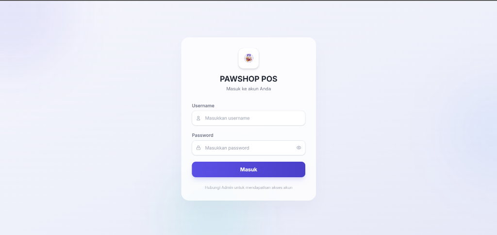
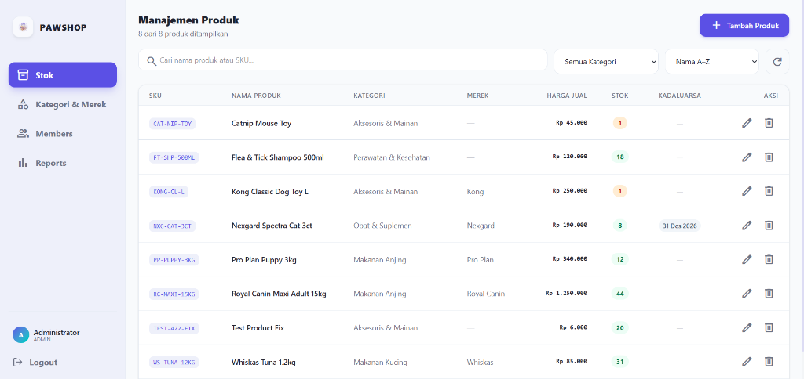
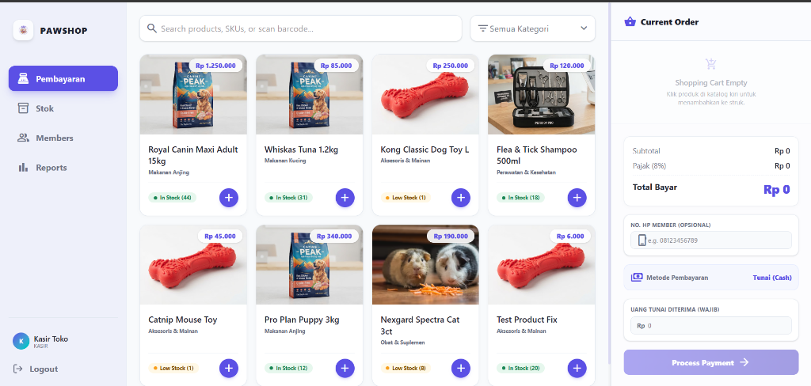

# PawShop POS - Petshop Point of Sale System

A modern, fast, and responsive Point of Sale (POS) system designed specifically for pet shops. Built with a robust backend using Elysia.js and Prisma ORM, and a beautiful glassmorphic frontend utilizing React, Vite, and TailwindCSS.

## 📸 Tampilan Aplikasi (Screenshots)

### 🔑 Halaman Login


### 📦 Manajemen Produk (Stok)


### 💳 Halaman Kasir / Pembayaran (POS)


---

## 🚀 Fitur Utama
*   **Kasir / Pembayaran (Cash Only)**: Transaksi cepat dengan input nominal tunai wajib, kalkulasi kembalian otomatis secara real-time, dan struk belanja virtual.
*   **Manajemen Member**: Fitur pendaftaran pelanggan untuk mengakumulasikan poin reward belanja (1 poin per Rp 10.000).
*   **Manajemen Produk & Stok**: Pencatatan SKU, kategori, brand, tanggal kedaluwarsa, sisa stok, gambar produk (upload berkas kustom), dan harga jual.
*   **Akses Multi-Role**:
    *   **Admin**: Manajemen produk/stok (Harga Beli disembunyikan/0), kategori & brand, data member, dan laporan ringkasan keuntungan/penjualan. (Akses POS Pembayaran dibatasi).
    *   **Kasir**: Melakukan transaksi pembayaran tunai, mencari/mendaftarkan member, dan melihat laporan kinerja harian.
*   **Desain Premium Light Theme**: Tampilan login frosted-glass dan dashboard responsif berorientasi kepuasan UX pengguna.

---

## 🔑 Akun Uji Coba Default (Seeded Accounts)

Gunakan akun-akun berikut untuk masuk ke aplikasi setelah database terisi:

*   **Akun Admin**:
    *   Username: `admin`
    *   Password: `admin123`
    *   Role: `ADMIN` (Akses penuh kecuali fitur transaksi kasir)
*   **Akun Kasir**:
    *   Username: `kasir`
    *   Password: `kasir123`
    *   Role: `KASIR` (Akses kasir/pembayaran, input member, dan riwayat penjualan)

---

## 🛠️ Panduan Setup & Instalasi

### Prasyarat
Sebelum memulai, pastikan Anda telah memasang:
*   [Node.js](https://nodejs.org/) (versi 18+) atau [Bun](https://bun.sh/)
*   [PostgreSQL](https://www.postgresql.org/) (database relational aktif)

---

### 1. Setup Backend (Server)

1.  Masuk ke direktori backend:
    ```bash
    cd backend
    ```
2.  Pasang dependencies menggunakan npm atau bun:
    ```bash
    bun install
    # atau
    npm install
    ```
3.  Salin berkas konfigurasi lingkungan `.env`:
    ```bash
    cp .env.example .env
    ```
    *Sesuaikan nilai `DATABASE_URL` (koneksi PostgreSQL) dan `JWT_SECRET` Anda.*

4.  Jalankan migrasi database & sinkronisasi schema:
    ```bash
    npx prisma db push
    ```
5.  *(Opsional)* Jalankan seeder untuk mengisi data awal:
    ```bash
    bun run src/seed_reports.ts
    ```
6.  Mulai server dalam mode pengembangan:
    ```bash
    bun run dev
    # atau
    npm run dev
    ```
    *Server backend akan berjalan di port `http://localhost:3000`.*

---

### 2. Setup Frontend (Client)

1.  Masuk ke direktori frontend:
    ```bash
    cd ../frontend
    ```
2.  Pasang dependencies:
    ```bash
    bun install
    # atau
    npm install
    ```
3.  Jalankan aplikasi web dalam mode pengembangan:
    ```bash
    bun run dev
    # atau
    npm run dev
    ```
    *Aplikasi frontend dapat diakses melalui browser di alamat `http://localhost:5173`.*

---

## 📖 Dokumentasi API Backend

Semua endpoint dilindungi menggunakan autentikasi Bearer Token (JWT), kecuali endpoint registrasi & login. Sertakan header berikut pada request terproteksi:
`Authorization: Bearer <your_jwt_token>`

### 🔐 1. Autentikasi
*   **POST** `/api/auth/register` (Registrasi Akun Baru)
    *   Body: `{ "username": "string", "password": "MIN_4_CHARS", "name": "string", "role": "ADMIN" | "KASIR" }`
*   **POST** `/api/auth/login` (Login & Dapatkan Token JWT)
    *   Body: `{ "username": "string", "password": "string" }`
    *   Response: `{ "success": true, "token": "JWT_TOKEN", "user": { "id": "uuid", "username": "string", "role": "ADMIN" | "KASIR" } }`

### 👥 2. Manajemen Member
*   **GET** `/api/members` (Daftar & Pencarian Member)
    *   Query Parameter: `search` (Nama, No HP, Kode Member)
*   **POST** `/api/members` (Registrasi Member Baru)
    *   Body: `{ "name": "string", "phone": "string" }`
    *   *Kode member unik (format MEM-XXXXXX) digenerate otomatis di sisi backend.*
*   **PUT** `/api/members/:id` (Perbarui Informasi Member)
    *   Body: `{ "name": "string", "phone": "string" }`
*   **DELETE** `/api/members/:id` (Hapus Member)

### 📦 3. Manajemen Produk (Stok)
*   **GET** `/api/products` (Mendapatkan Daftar Produk)
    *   Query Parameters: `search` (Nama/SKU), `categoryId` (Filter Kategori), `sortBy` (`price_asc` | `price_desc` | `stock_asc` | `stock_desc` | `name_asc`)
*   **POST** `/api/products` (Tambah Produk - Akses: Admin)
    *   Body: `{ "sku": "string", "name": "string", "categoryId": 1, "brandId": 1 | null, "sellingPrice": number, "stock": number, "expiredDate": "YYYY-MM-DD" | null, "imageUrl": "base64_string" | null }`
*   **PUT** `/api/products/:id` (Perbarui Detail Produk - Akses: Admin)
*   **DELETE** `/api/products/:id` (Hapus Produk - Akses: Admin)

### 🏷️ 4. Kategori & Merek (Akses Tulis: Admin)
*   **GET / POST / PUT / DELETE** `/api/categories` (Manajemen Kategori)
*   **GET / POST / PUT / DELETE** `/api/brands` (Manajemen Merek/Brand)

### 💳 5. Transaksi Kasir & Laporan
*   **POST** `/api/transactions` (Proses Checkout Pembayaran Tunai)
    *   Body: `{ "paymentMethod": "CASH", "memberId": number | null, "items": [{ "productId": number, "quantity": number }] }`
    *   *Jika `memberId` diinputkan, backend otomatis menghitung poin tambahan (1 poin per Rp 10.000 nominal transaksi).*
*   **GET** `/api/transactions` (Riwayat Transaksi)
*   **GET** `/api/transactions/reports` (Laporan Statistik Penjualan)
    *   Query Parameter: `type` (`daily` | `weekly` | `monthly`)

---

## 🧪 Testing / Pengujian

Aplikasi ini menggunakan **Bun Test runner** bawaan untuk menjalankan pengujian unit (*Unit Testing*) dan pengujian integrasi (*Integration Testing*) secara cepat.

### Cara Menjalankan Tes

1.  Masuk ke direktori `backend`:
    ```bash
    cd backend
    ```
2.  Jalankan perintah pengujian:
    ```bash
    bun test
    # atau
    npm test
    ```

### Cakupan Tes

1.  **Unit Testing (`backend/tests/unit.test.ts`)**:
    *   Menguji fungsionalitas rumus perhitungan poin member (1 poin per kelipatan Rp 10.000).
    *   Menguji validasi request payload untuk penambahan produk baru (deteksi field wajib, harga jual, dan stok non-negatif).
    *   Menguji utilitas enkripsi password menggunakan modul Bun password hasher.
2.  **Integration Testing (`backend/tests/integration.test.ts`)**:
    *   Menguji integritas koneksi database PostgreSQL melalui Prisma ORM.
    *   Menguji proses alur CRUD member (Create, Read, Update, Delete) secara langsung ke database.
    *   Menguji penanganan *constraint error* database saat terjadi duplikasi data (seperti nomor telepon ganda).

